# 3DObjectViewer.Core - Design Document

## Overview

**3DObjectViewer.Core** is a platform-independent class library that provides the core functionality for 3D physics simulation and MVVM infrastructure. This library is designed to be reusable and decoupled from any specific UI framework.

### Library Capabilities

| Feature | Description |
|---------|-------------|
| **Physics Simulation** | SIMD-optimized physics engine with gravity, collision detection, and response |
| **MVVM Infrastructure** | Base classes for ViewModels, commands, and value converters |
| **Renderer Abstractions** | Interfaces for implementing custom 3D renderers |
| **Shared Models** | Common data structures used across the application |

### Target Framework
- .NET 10
- C# 14.0
- Platform-independent (no WPF dependencies)

---

## Project Structure

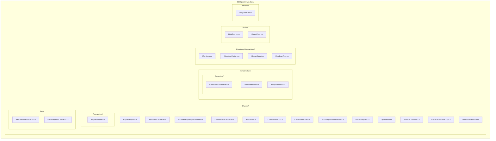

---

## Architecture

### Layer Diagram

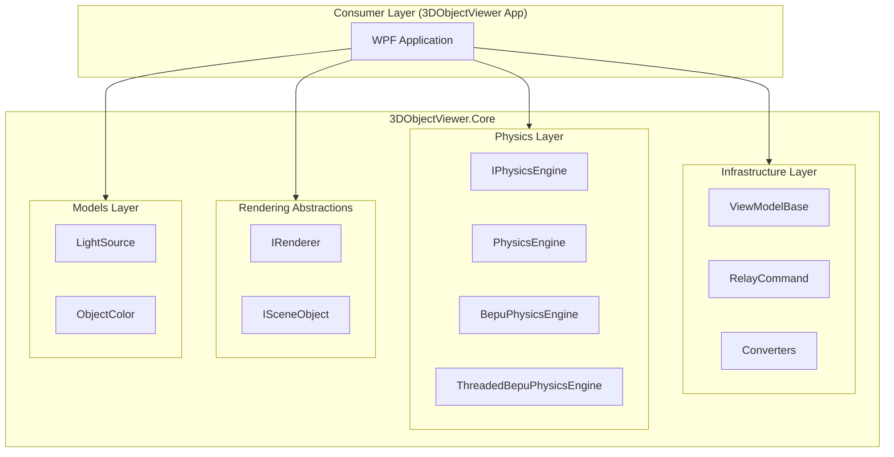

---

## Physics System

### Physics Engine Hierarchy

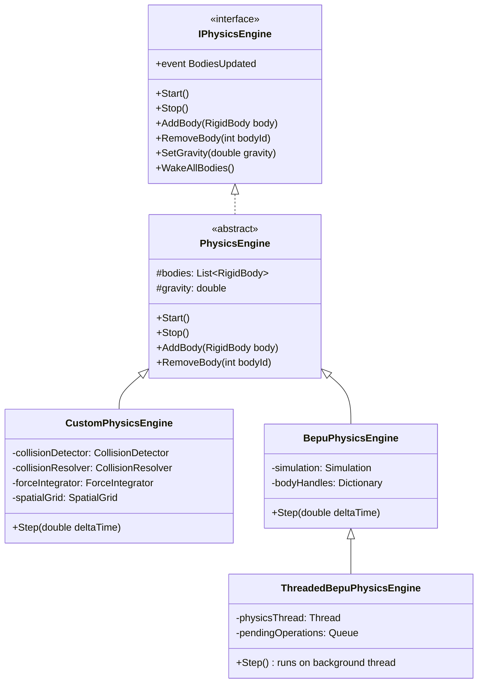

### Physics Pipeline

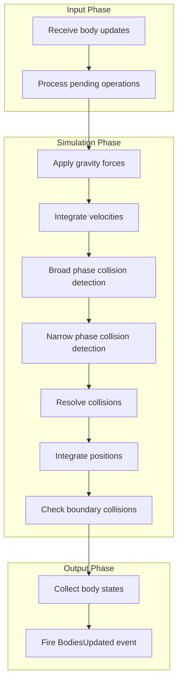

### RigidBody Class

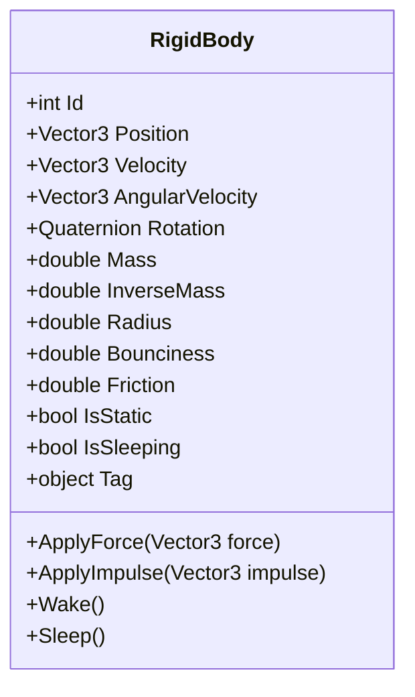

### Collision Detection

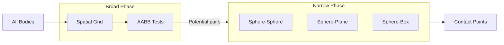

### Spatial Grid Optimization

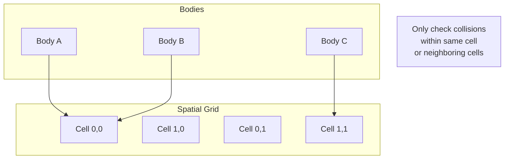

### Threading Model (ThreadedBepuPhysicsEngine)

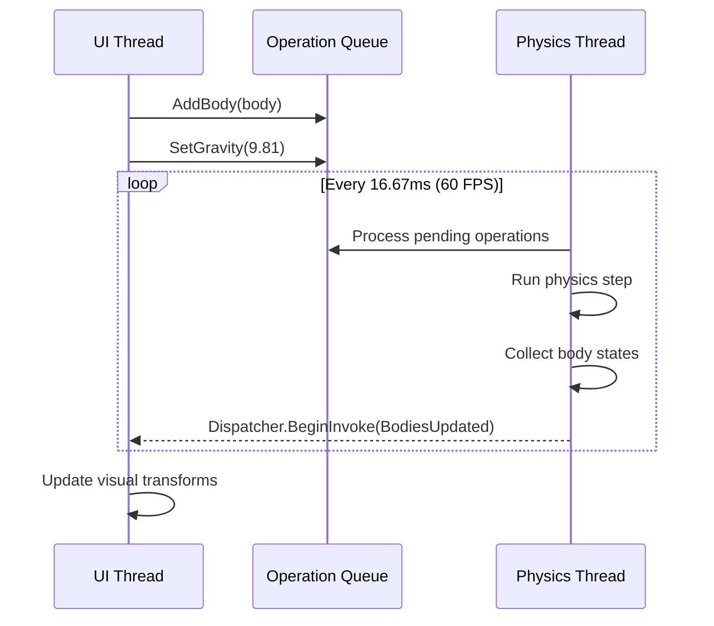

---

## Infrastructure

### MVVM Base Classes

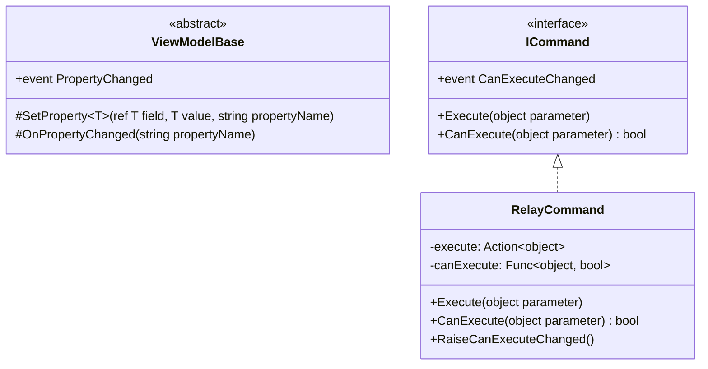

### Value Converters

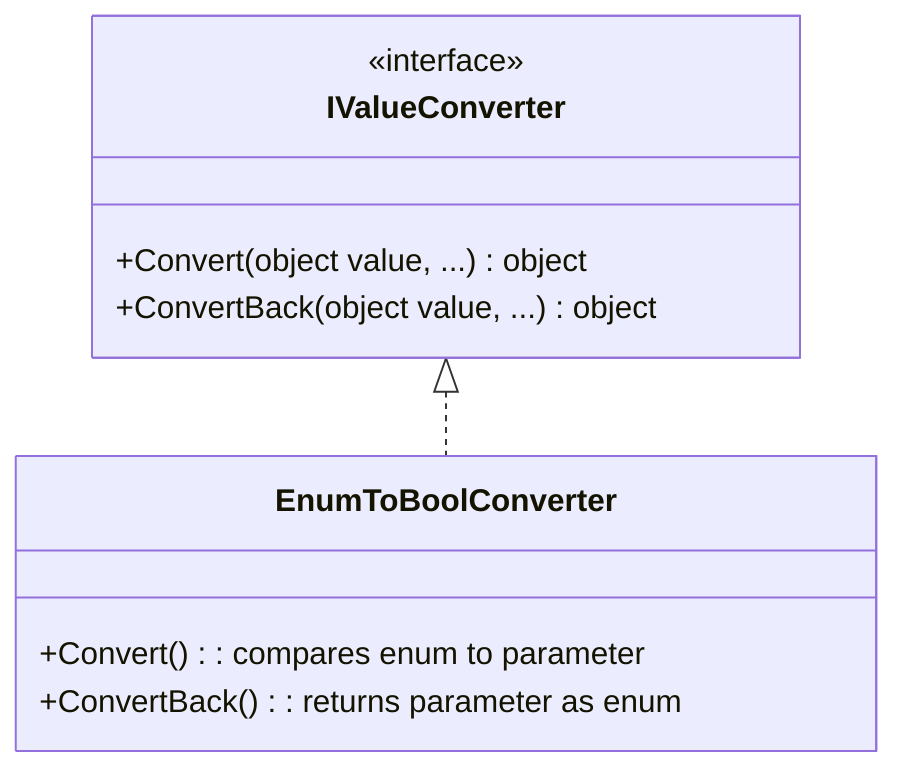

---

## Rendering Abstractions

### Renderer Interface Hierarchy

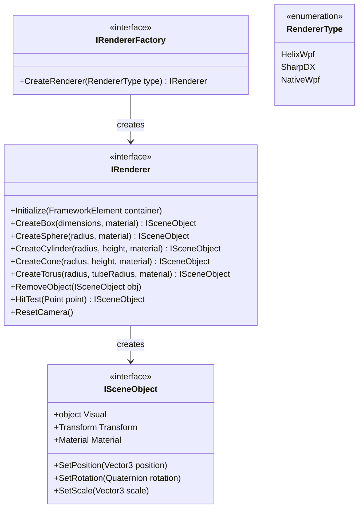

### Renderer Implementation Flow

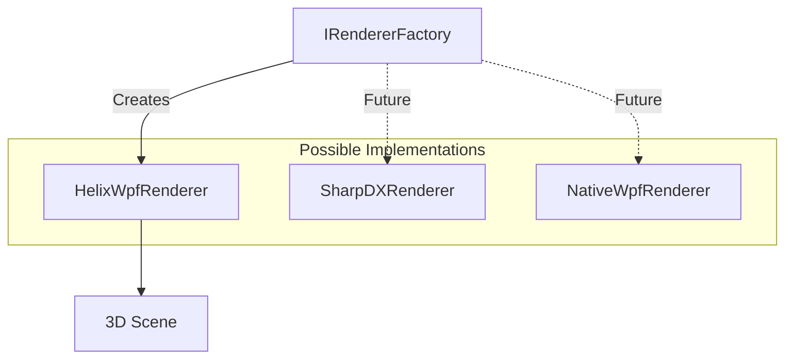

---

## Models

### LightSource

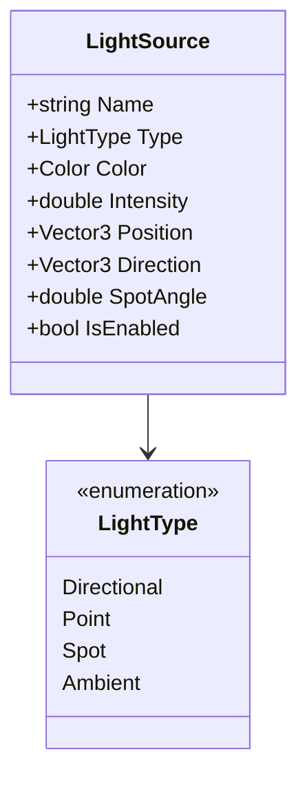

### ObjectColor

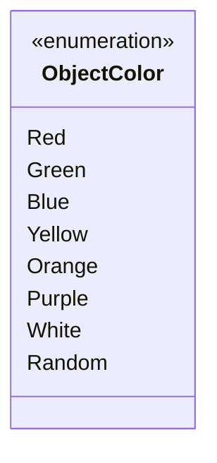

---

## Helpers

### DragPlane3D

Utility class for calculating drag positions in 3D space.

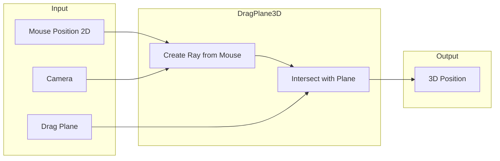

---

## Dependencies

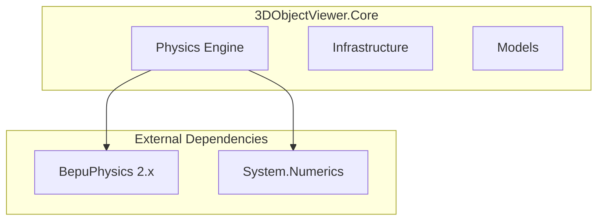

| Package | Purpose |
|---------|---------|
| BepuPhysics | High-performance physics simulation |
| System.Numerics | SIMD-accelerated vector/matrix math |

---

## Design Decisions

### 1. Interface-Based Physics Engine

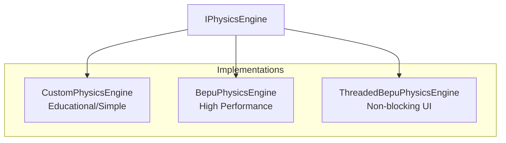

**Decision:** Use interface `IPhysicsEngine` for all physics implementations.

**Benefit:** Easily swap physics engines without changing consumer code.

### 2. SIMD Optimization

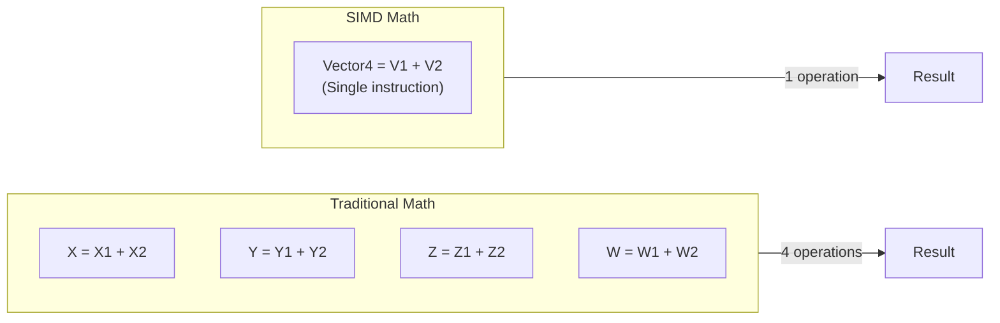

**Decision:** Use `System.Numerics` types for all physics calculations.

**Benefit:** 2-4x performance improvement on vector operations.

### 3. Platform Independence

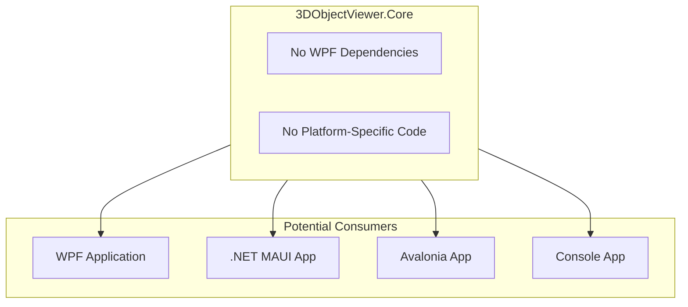

**Decision:** Keep Core library free of WPF dependencies.

**Benefit:** Can be reused in other .NET UI frameworks or headless scenarios.

### 4. Factory Pattern for Engine Creation

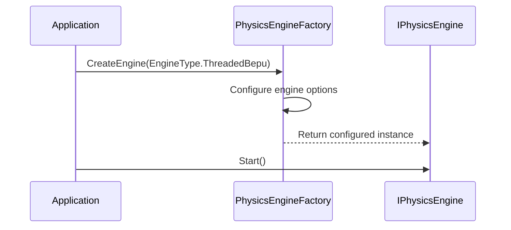

**Decision:** Use factory to create physics engines.

**Benefit:** Centralized configuration and consistent initialization.

---

## Thread Safety

### Physics Engine Threading

```mermaid
flowchart TB
    subgraph UIThread["UI Thread"]
        Add[AddBody]
        Remove[RemoveBody]
        Set[SetGravity]
    end
    
    subgraph Queue["Thread-Safe Queue"]
        Q[Pending Operations]
    end
    
    subgraph PhysicsThread["Physics Thread"]
        Process[Process Queue]
        Simulate[Run Simulation]
        Notify[Notify UI]
    end
    
    Add --> Q
    Remove --> Q
    Set --> Q
    
    Q --> Process
    Process --> Simulate
    Simulate --> Notify
    Notify -->|Dispatcher| UIThread
```

**Key Points:**
- All public methods on `ThreadedBepuPhysicsEngine` are thread-safe
- Operations are queued and processed on the physics thread
- Results are dispatched back to the UI thread

---

## Performance Considerations

### Spatial Partitioning

```mermaid
flowchart TB
    subgraph NaiveApproach["Naive O(n²)"]
        N1[Check every pair]
        N2[100 bodies = 4,950 checks]
    end
    
    subgraph SpatialGrid["Spatial Grid O(n)"]
        S1[Partition into cells]
        S2[Only check neighbors]
        S3[100 bodies ? 200 checks]
    end
    
    NaiveApproach -->|Slow| Performance1[Poor Performance]
    SpatialGrid -->|Fast| Performance2[Good Performance]
```

### Sleep States

```mermaid
stateDiagram-v2
    [*] --> Awake : Body created
    Awake --> Sleeping : Velocity below threshold
    Sleeping --> Awake : Collision or force applied
    Sleeping --> Sleeping : Skip simulation
```

**Benefit:** Sleeping bodies don't participate in simulation, improving performance.

---

## Future Extensions

```mermaid
flowchart TB
    subgraph Current["Current Features"]
        Sphere[Sphere Collisions]
        Gravity[Gravity]
        Basic[Basic Materials]
    end
    
    subgraph Future["Potential Extensions"]
        Mesh[Mesh Collisions]
        Joints[Joints/Constraints]
        Soft[Soft Body Physics]
        Fluid[Fluid Simulation]
    end
    
    Current --> Future
```

Potential future additions:
- Convex mesh collision shapes
- Joint constraints (hinge, ball, slider)
- Soft body simulation
- Fluid dynamics
- Serialization/deserialization of physics state
