# 3DObjectViewer - Design Document

## Overview

**3DObjectViewer** is a WPF desktop application that provides an interactive 3D environment for creating, manipulating, and observing 3D objects with real-time physics simulation. Users can drop objects into a virtual space and watch them fall, bounce, and interact under the influence of gravity.

### Application Capabilities

| Feature | Description |
|---------|-------------|
| **Object Creation** | Add 3D primitives (cubes, spheres, cylinders, cones, toruses) with customizable size and color |
| **Batch Drop** | Drop multiple objects simultaneously (1-20 at once) |
| **Physics Simulation** | Objects fall under gravity, collide with each other and boundaries, and come to rest naturally |
| **Object Manipulation** | Select objects, drag to move them, adjust position/rotation/scale via sliders |
| **Dynamic Lighting** | Multiple light sources with adjustable position, direction, color, and brightness |
| **Performance Monitoring** | Real-time display of FPS, frame time, object count, triangle count, and memory usage |

### Target Framework
- .NET 10 (Windows)
- WPF (Windows Presentation Foundation)
- C# 14.0

---

## Project Structure

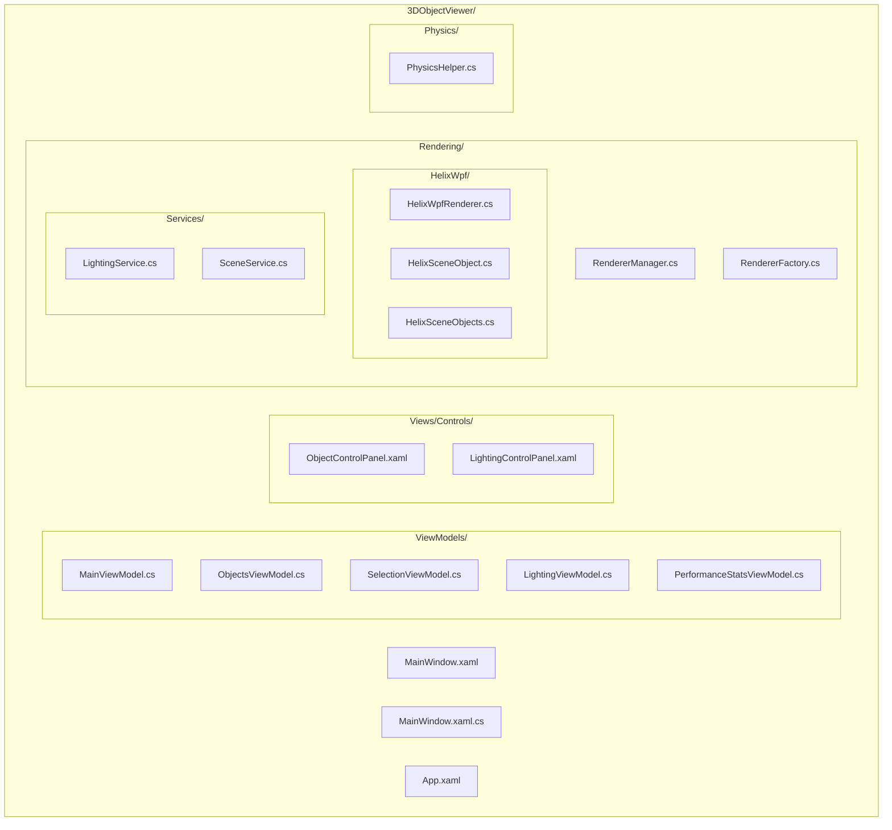
```mermaid
graph TB
    subgraph "3DObjectViewer/"
        subgraph "ViewModels/"
            VM1[MainViewModel.cs]
            VM2[ObjectsViewModel.cs]
            VM3[SelectionViewModel.cs]
            VM4[LightingViewModel.cs]
            VM5[PerformanceStatsViewModel.cs]
        end
        
        subgraph "Views/Controls/"
            V1[ObjectControlPanel.xaml]
            V2[LightingControlPanel.xaml]
        end
        
        subgraph "Rendering/"
            subgraph "HelixWpf/"
                R1[HelixWpfRenderer.cs]
                R2[HelixSceneObject.cs]
                R3[HelixSceneObjects.cs]
            end
            subgraph "Services/"
                RS1[LightingService.cs]
            end
            R4[RendererManager.cs]
            R5[RendererFactory.cs]
        end
        
        subgraph "Physics/"
            P1[PhysicsHelper.cs]
        end
        
        subgraph "Services/"
            S1[SceneService.cs]
        end
        
        MW[MainWindow.xaml]
        MWC[MainWindow.xaml.cs]
        APP[App.xaml]
    end
```

---

## Architecture

### High-Level Architecture

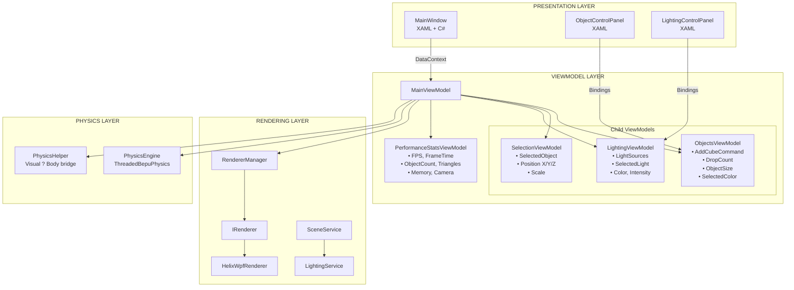
```mermaid
flowchart TB
    subgraph Presentation["PRESENTATION LAYER"]
        MW[MainWindow<br/>XAML + C#]
        OCP[ObjectControlPanel<br/>XAML]
        LCP[LightingControlPanel<br/>XAML]
    end
    
    subgraph ViewModel["VIEWMODEL LAYER"]
        MVM[MainViewModel]
        subgraph ChildVMs["Child ViewModels"]
            OVM[ObjectsViewModel<br/>• AddCubeCommand<br/>• DropCount<br/>• ObjectSize<br/>• SelectedColor]
            SVM[SelectionViewModel<br/>• SelectedObject<br/>• Position X/Y/Z<br/>• Scale]
            LVM[LightingViewModel<br/>• LightSources<br/>• SelectedLight<br/>• Color, Intensity]
        end
        PSVM[PerformanceStatsViewModel<br/>• FPS, FrameTime<br/>• ObjectCount, Triangles<br/>• Memory, Camera]
    end
    
    subgraph Rendering["RENDERING LAYER"]
        RM[RendererManager]
        IR[IRenderer]
        HWR[HelixWpfRenderer]
        SS[SceneService]
        LS[LightingService]
    end
    
    subgraph Physics["PHYSICS LAYER"]
        PE[PhysicsEngine<br/>ThreadedBepuPhysics]
        PH[PhysicsHelper<br/>Visual ? Body bridge]
    end
    
    MW -->|DataContext| MVM
    OCP -->|Bindings| OVM
    LCP -->|Bindings| LVM
    
    MVM --> OVM
    MVM --> SVM
    MVM --> LVM
    MVM --> PSVM
    
    MVM --> RM
    RM --> IR
    IR --> HWR
    SS --> LS
    
    MVM --> PE
    MVM --> PH
```

### MVVM Pattern Implementation

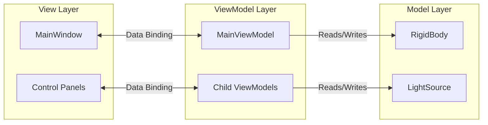
```mermaid
graph LR
    subgraph View["View Layer"]
        V1[MainWindow]
        V2[Control Panels]
    end
    
    subgraph ViewModel["ViewModel Layer"]
        VM1[MainViewModel]
        VM2[Child ViewModels]
    end
    
    subgraph Model["Model Layer"]
        M1[RigidBody]
        M2[LightSource]
    end
    
    V1 <-->|Data Binding| VM1
    V2 <-->|Data Binding| VM2
    VM1 -->|Reads/Writes| M1
    VM2 -->|Reads/Writes| M2
```

| Layer | Components | Responsibilities |
|-------|------------|------------------|
| **View** | MainWindow, Control Panels | UI layout, user input, data binding |
| **ViewModel** | MainViewModel + child VMs | Business logic, state management, commands |
| **Model** | RigidBody, LightSource | Data structures, physics state |

---

## ViewModels

### ViewModel Hierarchy

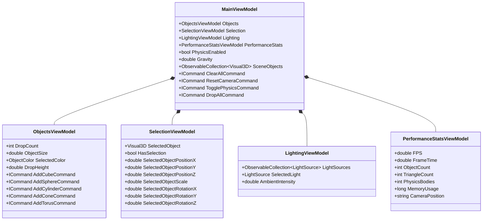
```mermaid
classDiagram
    class MainViewModel {
        +ObjectsViewModel Objects
        +SelectionViewModel Selection
        +LightingViewModel Lighting
        +PerformanceStatsViewModel PerformanceStats
        +bool PhysicsEnabled
        +double Gravity
        +ObservableCollection~Visual3D~ SceneObjects
        +ICommand ClearAllCommand
        +ICommand ResetCameraCommand
        +ICommand TogglePhysicsCommand
        +ICommand DropAllCommand
    }
    
    class ObjectsViewModel {
        +int DropCount
        +double ObjectSize
        +ObjectColor SelectedColor
        +double DropHeight
        +ICommand AddCubeCommand
        +ICommand AddSphereCommand
        +ICommand AddCylinderCommand
        +ICommand AddConeCommand
        +ICommand AddTorusCommand
    }
    
    class SelectionViewModel {
        +Visual3D SelectedObject
        +bool HasSelection
        +double SelectedObjectPositionX
        +double SelectedObjectPositionY
        +double SelectedObjectPositionZ
        +double SelectedObjectScale
        +double SelectedObjectRotationX
        +double SelectedObjectRotationY
        +double SelectedObjectRotationZ
    }
    
    class LightingViewModel {
        +ObservableCollection~LightSource~ LightSources
        +LightSource SelectedLight
        +double AmbientIntensity
    }
    
    class PerformanceStatsViewModel {
        +double FPS
        +double FrameTime
        +int ObjectCount
        +int TriangleCount
        +int PhysicsBodies
        +long MemoryUsage
        +string CameraPosition
    }
    
    MainViewModel *-- ObjectsViewModel
    MainViewModel *-- SelectionViewModel
    MainViewModel *-- LightingViewModel
    MainViewModel *-- PerformanceStatsViewModel
```

### MainViewModel

The root ViewModel that orchestrates all child ViewModels and services.

**Responsibilities:**
- Manages the `SceneObjects` collection shared by all child VMs
- Owns the `PhysicsEngine` instance
- Handles physics events and updates visual transforms
- Coordinates object creation, selection, and deletion

**Key Properties:**

| Property | Type | Description |
|----------|------|-------------|
| `Objects` | `ObjectsViewModel` | Object creation settings |
| `Selection` | `SelectionViewModel` | Selected object manipulation |
| `Lighting` | `LightingViewModel` | Light source management |
| `PerformanceStats` | `PerformanceStatsViewModel` | Real-time statistics |
| `PhysicsEnabled` | `bool` | Toggle physics simulation |
| `Gravity` | `double` | Gravity strength (m/s^2) |
| `SceneObjects` | `ObservableCollection<Visual3D>` | All 3D objects in scene |

**Commands:**

| Command | Action |
|---------|--------|
| `ClearAllCommand` | Remove all objects from scene |
| `ResetCameraCommand` | Reset camera to default position |
| `TogglePhysicsCommand` | Start/stop physics simulation |
| `DropAllCommand` | Wake all sleeping objects |

### ObjectsViewModel

Manages object creation with configurable settings.

**Key Properties:**

| Property | Type | Description |
|----------|------|-------------|
| `DropCount` | `int` | Number of objects to drop (1-50) |
| `ObjectSize` | `double` | Size multiplier (0.5-3.0) |
| `SelectedColor` | `ObjectColor` | Color for new objects |
| `DropHeight` | `double` | Height to drop from (2-15m) |

**Commands:**

| Command | Creates |
|---------|---------|
| `AddCubeCommand` | BoxVisual3D (N times) |
| `AddSphereCommand` | SphereVisual3D (N times) |
| `AddCylinderCommand` | PipeVisual3D (N times) |
| `AddConeCommand` | TruncatedConeVisual3D (N times) |
| `AddTorusCommand` | TorusVisual3D (N times) |

### SelectionViewModel

Handles selected object manipulation.

**Key Properties:**

| Property | Type | Description |
|----------|------|-------------|
| `SelectedObject` | `Visual3D?` | Currently selected object |
| `HasSelection` | `bool` | Whether an object is selected |
| `SelectedObjectPositionX/Y/Z` | `double` | Position sliders |
| `SelectedObjectScale` | `double` | Scale multiplier |
| `SelectedObjectRotationX/Y/Z` | `double` | Rotation angles |

**Events:**

| Event | Description |
|-------|-------------|
| `SelectionChanged` | Selection changed (update highlight) |
| `ObjectDeleted` | Object was deleted (cleanup physics) |
| `ObjectMoved` | Object position changed (sync physics) |

### LightingViewModel

Manages scene lighting configuration.

**Key Properties:**

| Property | Type | Description |
|----------|------|-------------|
| `LightSources` | `ObservableCollection<LightSource>` | All lights |
| `SelectedLight` | `LightSource?` | Light being edited |
| `AmbientIntensity` | `double` | Ambient light level |

### PerformanceStatsViewModel

Displays real-time performance metrics.

**Displayed Statistics:**

| Statistic | Update Rate | Source |
|-----------|-------------|--------|
| FPS | 500ms | Frame timing |
| Frame Time | 500ms | Frame timing |
| Object Count | 250ms | SceneObjects.Count |
| Triangle Count | 250ms | Visual tree traversal |
| Physics Bodies | 250ms | PhysicsEngine.BodyCount |
| Memory Usage | 250ms | GC.GetTotalMemory() |
| Camera Position | 250ms | HelixViewport.Camera |

---

## Rendering System

### Rendering Architecture

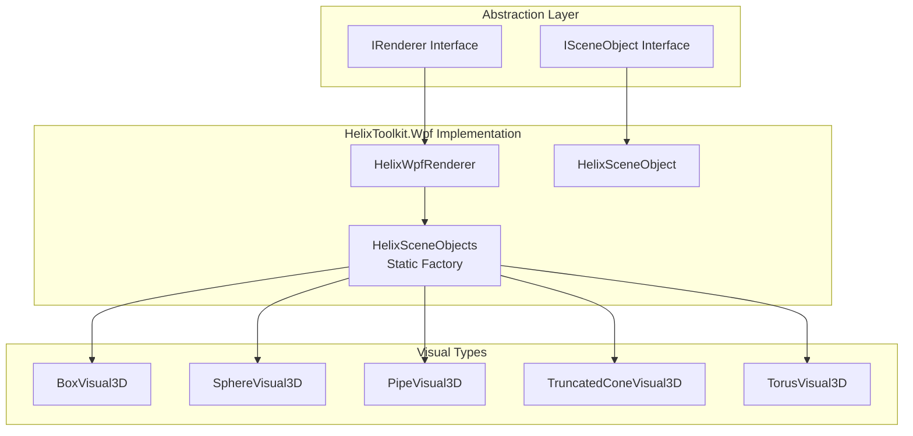
```mermaid
flowchart TB
    subgraph Abstraction["Abstraction Layer"]
        IR[IRenderer Interface]
        ISO[ISceneObject Interface]
    end
    
    subgraph Implementation["HelixToolkit.Wpf Implementation"]
        HWR[HelixWpfRenderer]
        HSO[HelixSceneObject]
        HSOs[HelixSceneObjects<br/>Static Factory]
    end
    
    subgraph Visuals["Visual Types"]
        BV[BoxVisual3D]
        SV[SphereVisual3D]
        PV[PipeVisual3D]
        TCV[TruncatedConeVisual3D]
        TV[TorusVisual3D]
    end
    
    IR --> HWR
    ISO --> HSO
    HWR --> HSOs
    HSOs --> BV
    HSOs --> SV
    HSOs --> PV
    HSOs --> TCV
    HSOs --> TV
```

### HelixToolkit.Wpf Integration

The application uses HelixToolkit.Wpf for 3D rendering, wrapped behind the `IRenderer` interface for potential future extensibility.

**HelixWpfRenderer** implements:
- Viewport creation and management
- Primitive creation (box, sphere, cylinder, cone, torus)
- Hit testing for object selection
- Camera control

**Supported Visual Types:**

| Visual | HelixToolkit Class | Physics Shape |
|--------|-------------------|---------------|
| Box | `BoxVisual3D` | Sphere (bounding) |
| Sphere | `SphereVisual3D` | Sphere |
| Cylinder | `PipeVisual3D` | Sphere (bounding) |
| Cone | `TruncatedConeVisual3D` | Sphere (bounding) |
| Torus | `TorusVisual3D` | Sphere (bounding) |

### Performance Optimization

**Problem:** HelixToolkit regenerates meshes when visual properties (Center, Origin, Point1/Point2) change.

**Solution:** The `PhysicsHelper` class uses a **normalize-once pattern**:

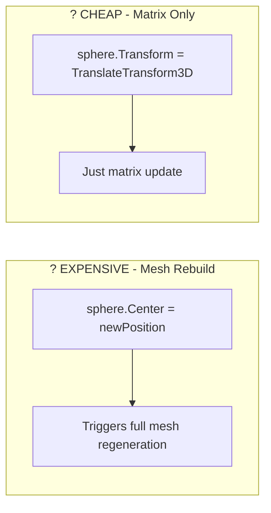
```mermaid
flowchart LR
    subgraph Bad["? EXPENSIVE - Mesh Rebuild"]
        A1[sphere.Center = newPosition]
        A2[Triggers full mesh regeneration]
    end
    
    subgraph Good["? CHEAP - Matrix Only"]
        B1[sphere.Transform = TranslateTransform3D]
        B2[Just matrix update]
    end
    
    A1 --> A2
    B1 --> B2
```
1. At creation: Move geometry to origin (triggers one mesh rebuild)
2. Every frame: Only update `Transform` property (cheap matrix operation)

---

## Physics Integration

### Physics Architecture

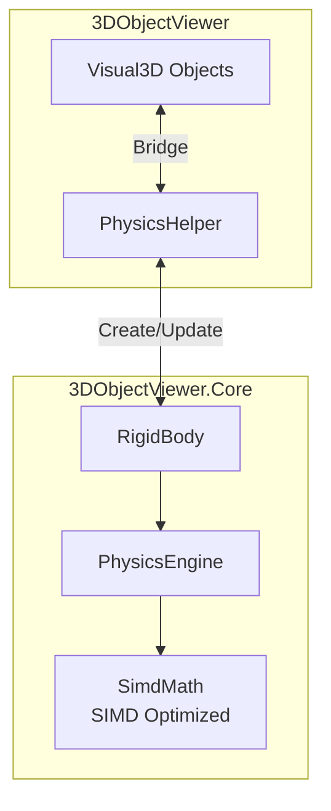
```mermaid
flowchart TB
    subgraph Core["3DObjectViewer.Core"]
        PE[PhysicsEngine]
        RB[RigidBody]
        SM[SimdMath<br/>SIMD Optimized]
    end
    
    subgraph App["3DObjectViewer"]
        PH[PhysicsHelper]
        V3D[Visual3D Objects]
    end
    
    V3D <-->|Bridge| PH
    PH <-->|Create/Update| RB
    RB --> PE
    PE --> SM
```

### PhysicsHelper

Bridges the gap between physics bodies and visual objects.

**Responsibilities:**
1. Create `RigidBody` from `Visual3D` with correct dimensions
2. Configure physics properties based on object type
3. Apply physics transforms to visuals efficiently

**Object-Specific Physics Properties:**

| Object Type | Bounciness | Friction | Mass |
|-------------|------------|----------|------|
| Sphere | 0.6 | 0.3 | 1.0 |
| Box | 0.3 | 0.6 | 2.0 |
| Cylinder | 0.35 | 0.5 | 1.5 |
| Cone | 0.3 | 0.55 | 1.2 |
| Torus | 0.5 | 0.4 | 0.8 |

### Data Flow: Object Creation

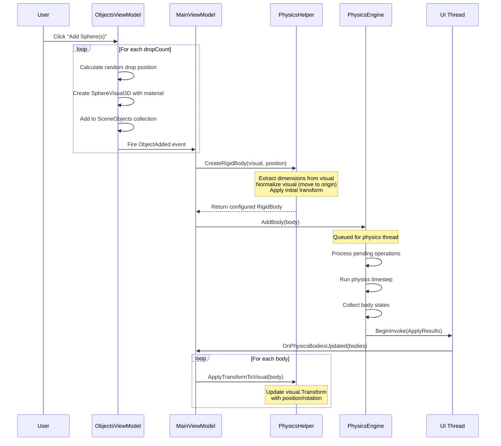
```mermaid
sequenceDiagram
    participant User
    participant OVM as ObjectsViewModel
    participant MVM as MainViewModel
    participant PH as PhysicsHelper
    participant PE as PhysicsEngine
    participant UI as UI Thread

    User->>OVM: Click "Add Sphere(s)"
    
    loop For each dropCount
        OVM->>OVM: Calculate random drop position
        OVM->>OVM: Create SphereVisual3D with material
        OVM->>OVM: Add to SceneObjects collection
        OVM->>MVM: Fire ObjectAdded event
    end
    
    MVM->>PH: CreateRigidBody(visual, position)
    Note over PH: Extract dimensions from visual<br/>Normalize visual (move to origin)<br/>Apply initial transform
    PH-->>MVM: Return configured RigidBody
    
    MVM->>PE: AddBody(body)
    Note over PE: Queued for physics thread
    
    PE->>PE: Process pending operations
    PE->>PE: Run physics timestep
    PE->>PE: Collect body states
    PE->>UI: BeginInvoke(ApplyResults)
    
    UI->>MVM: OnPhysicsBodiesUpdated(bodies)
    
    loop For each body
        MVM->>PH: ApplyTransformToVisual(body)
        Note over PH: Update visual.Transform<br/>with position/rotation
    end
```

---

## User Interface

### Main Window Layout

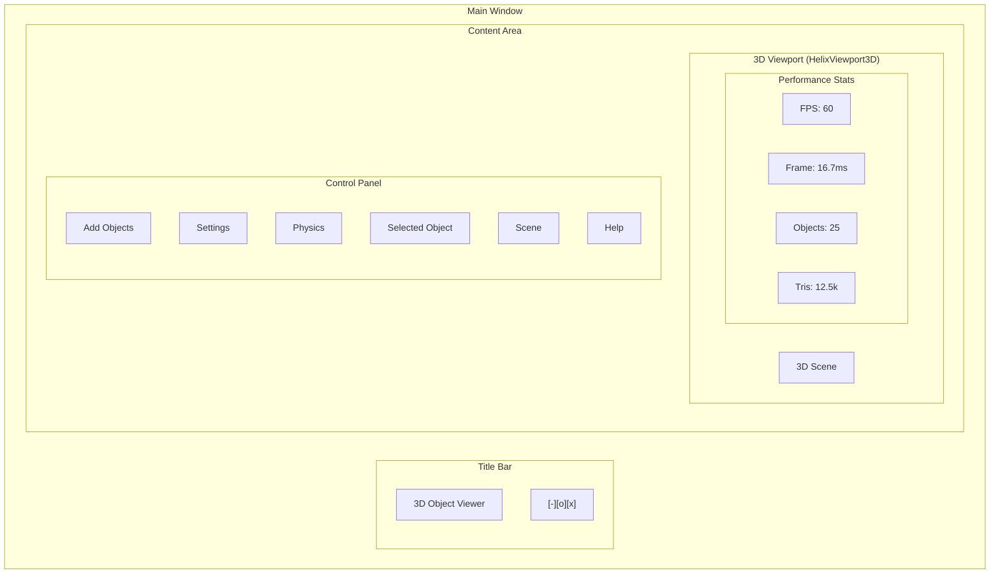
```mermaid
flowchart TB
    subgraph MainWindow["Main Window"]
        subgraph Header["Title Bar"]
            Title[3D Object Viewer]
            Controls["[-][o][x]"]
        end
        
        subgraph Content["Content Area"]
            subgraph Viewport["3D Viewport (HelixViewport3D)"]
                Scene[3D Scene]
                subgraph Stats["Performance Stats"]
                    FPS[FPS: 60]
                    Frame[Frame: 16.7ms]
                    Objects[Objects: 25]
                    Tris[Tris: 12.5k]
                end
            end
            
            subgraph ControlPanel["Control Panel"]
                AddObj[Add Objects]
                Settings[Settings]
                Physics[Physics]
                Selected[Selected Object]
                SceneCtrl[Scene]
                Help[Help]
            end
        end
    end
```

### Control Panel Sections

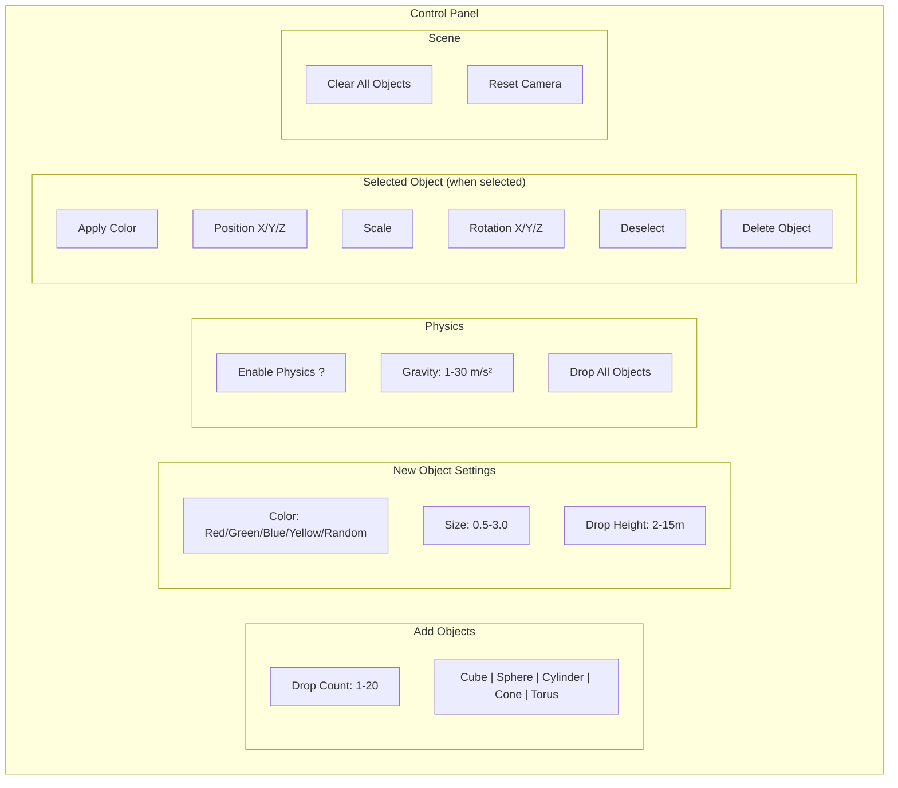
```mermaid
flowchart TB
    subgraph CP["Control Panel"]
        subgraph AddObjects["Add Objects"]
            DC[Drop Count: 1-20]
            Buttons["Cube | Sphere | Cylinder | Cone | Torus"]
        end
        
        subgraph Settings["New Object Settings"]
            Color["Color: Red/Green/Blue/Yellow/Random"]
            Size["Size: 0.5-3.0"]
            Height["Drop Height: 2-15m"]
        end
        
        subgraph Physics["Physics"]
            Enable[Enable Physics ?]
            Gravity["Gravity: 1-30 m/s²"]
            DropAll[Drop All Objects]
        end
        
        subgraph Selected["Selected Object (when selected)"]
            ApplyColor[Apply Color]
            Position["Position X/Y/Z"]
            Scale["Scale"]
            Rotation["Rotation X/Y/Z"]
            Deselect[Deselect]
            Delete[Delete Object]
        end
        
        subgraph Scene["Scene"]
            ClearAll[Clear All Objects]
            ResetCam[Reset Camera]
        end
    end
```

### Mouse Controls

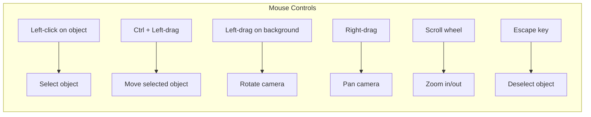
```mermaid
flowchart LR
    subgraph MouseActions["Mouse Controls"]
        Click["Left-click on object"] --> Select["Select object"]
        CtrlDrag["Ctrl + Left-drag"] --> Move["Move selected object"]
        LeftDrag["Left-drag on background"] --> Rotate["Rotate camera"]
        RightDrag["Right-drag"] --> Pan["Pan camera"]
        Scroll["Scroll wheel"] --> Zoom["Zoom in/out"]
        Escape["Escape key"] --> Deselect["Deselect object"]
    end
```

| Action | Behavior |
|--------|----------|
| Left-click on object | Select object |
| Ctrl + Left-drag | Move selected object |
| Left-drag on background | Rotate camera |
| Right-drag | Pan camera |
| Scroll wheel | Zoom in/out |
| Escape | Deselect object |

---

## Services

### Service Architecture

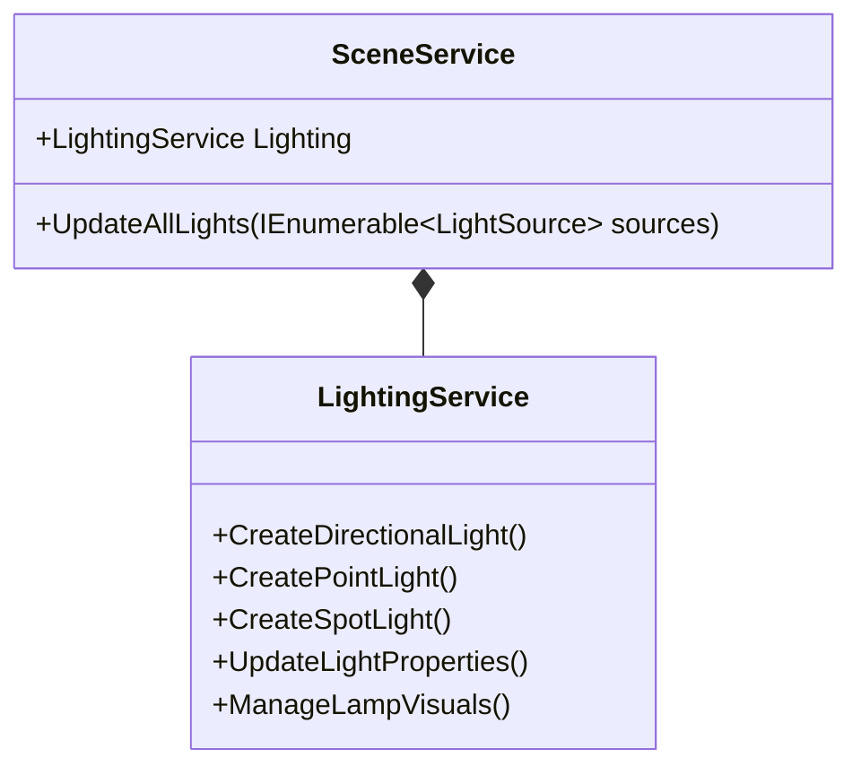
```mermaid
classDiagram
    class SceneService {
        +LightingService Lighting
        +UpdateAllLights(IEnumerable~LightSource~ sources)
    }
    
    class LightingService {
        +CreateDirectionalLight()
        +CreatePointLight()
        +CreateSpotLight()
        +UpdateLightProperties()
        +ManageLampVisuals()
    }
    
    SceneService *-- LightingService
```

### SceneService

Facade that coordinates scene-related services:

```csharp
public class SceneService
{
    public LightingService Lighting { get; }
    
    public void UpdateAllLights(IEnumerable<LightSource> sources);
}
```

### LightingService

Manages light visuals in the 3D scene:

- Creates DirectionalLight, PointLight, SpotLight instances
- Updates light properties when ViewModel changes
- Manages lamp fixture visuals

---

## Dependencies

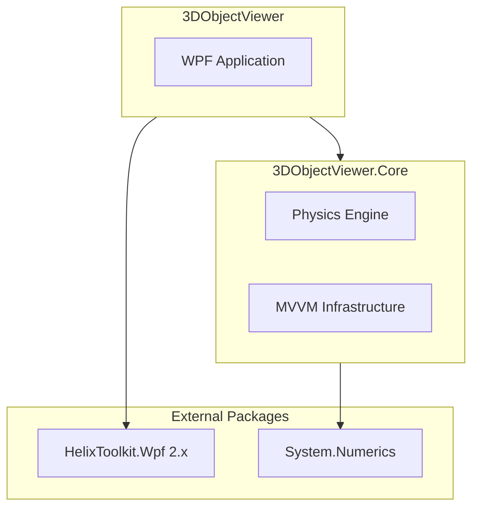
```mermaid
graph TB
    subgraph App["3DObjectViewer"]
        WPF[WPF Application]
    end
    
    subgraph Core["3DObjectViewer.Core"]
        Physics[Physics Engine]
        Infrastructure[MVVM Infrastructure]
    end
    
    subgraph External["External Packages"]
        Helix[HelixToolkit.Wpf 2.x]
        Numerics[System.Numerics]
    end
    
    App --> Core
    App --> Helix
    Core --> Numerics
```

| Package | Version | Purpose |
|---------|---------|---------|
| HelixToolkit.Wpf | 2.x | 3D rendering and viewport |
| 3DObjectViewer.Core | local | Physics engine and infrastructure |

---

## Design Decisions

### 1. Composition over Inheritance for ViewModels

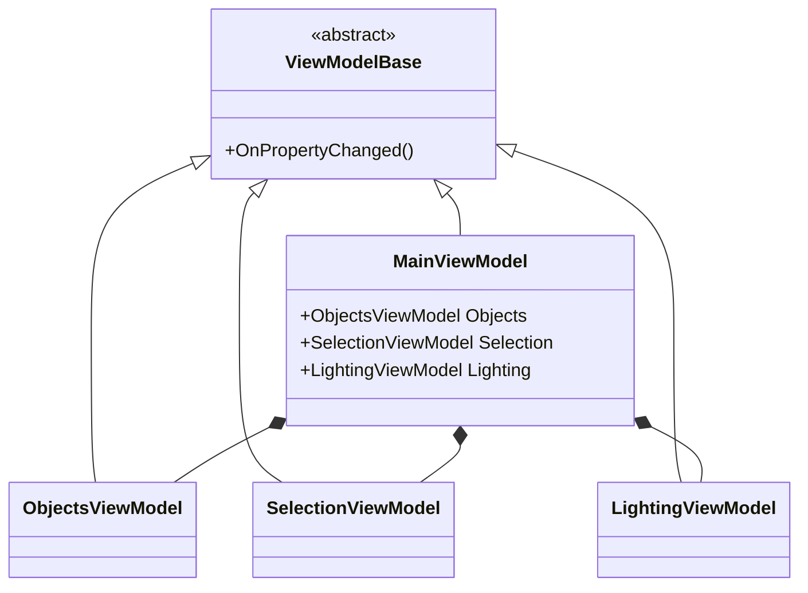
```mermaid
classDiagram
    class MainViewModel {
        +ObjectsViewModel Objects
        +SelectionViewModel Selection
        +LightingViewModel Lighting
    }
    
    class ViewModelBase {
        <<abstract>>
        +OnPropertyChanged()
    }
    
    ViewModelBase <|-- MainViewModel
    ViewModelBase <|-- ObjectsViewModel
    ViewModelBase <|-- SelectionViewModel
    ViewModelBase <|-- LightingViewModel
    
    MainViewModel *-- ObjectsViewModel
    MainViewModel *-- SelectionViewModel
    MainViewModel *-- LightingViewModel
```

**Decision:** MainViewModel composes child ViewModels rather than inheriting.

**Benefit:** Each ViewModel has a single responsibility, easier to test and maintain.

### 2. Event-Based Communication

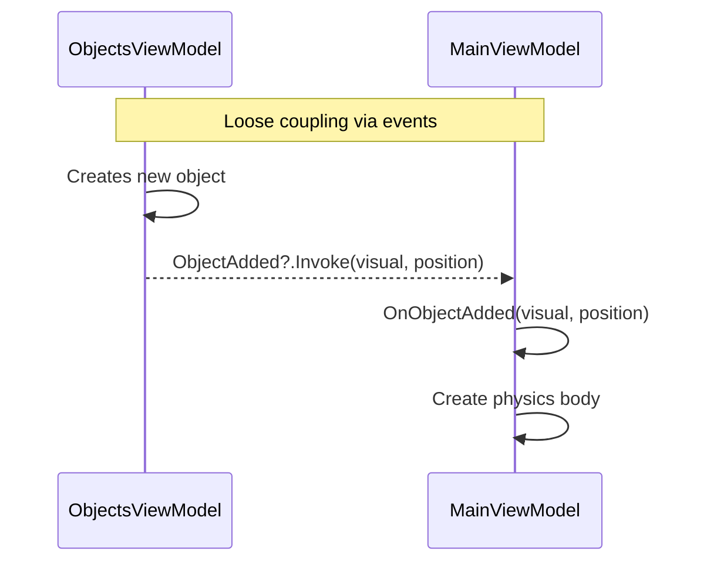
```mermaid
sequenceDiagram
    participant OVM as ObjectsViewModel
    participant MVM as MainViewModel
    
    Note over OVM,MVM: Loose coupling via events
    
    OVM->>OVM: Creates new object
    OVM-->>MVM: ObjectAdded?.Invoke(visual, position)
    MVM->>MVM: OnObjectAdded(visual, position)
    MVM->>MVM: Create physics body
```

**Decision:** ViewModels communicate via events, not direct method calls.

**Benefit:** Loose coupling, ViewModels don't need references to each other.

### 3. Static PhysicsHelper

**Decision:** PhysicsHelper is a static class with static caches.

**Rationale:**
- Only one physics-visual bridge per application
- Simplifies access from multiple ViewModels
- Caches are cleared when scene is cleared

**Tradeoff:** Harder to unit test, but acceptable for this application scope.

### 4. Transform-Only Visual Updates

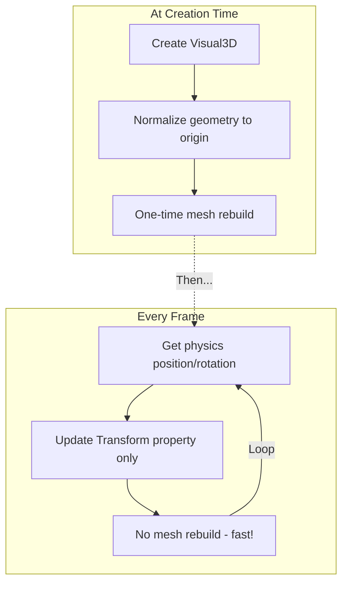
```mermaid
flowchart TB
    subgraph Creation["At Creation Time"]
        C1[Create Visual3D]
        C2[Normalize geometry to origin]
        C3[One-time mesh rebuild]
    end
    
    subgraph Runtime["Every Frame"]
        R1[Get physics position/rotation]
        R2[Update Transform property only]
        R3[No mesh rebuild - fast!]
    end
    
    C1 --> C2 --> C3
    C3 -.->|"Then..."| R1
    R1 --> R2 --> R3
    R3 -->|"Loop"| R1
```

**Decision:** Never modify visual geometry properties after creation.

**Benefit:** 100x+ performance improvement for physics updates.

### 5. Threaded Physics as Default

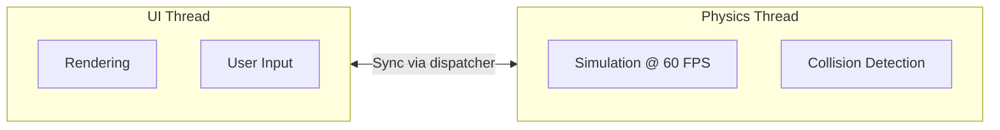
```mermaid
flowchart LR
    subgraph UIThread["UI Thread"]
        Render[Rendering]
        Input[User Input]
    end
    
    subgraph PhysicsThread["Physics Thread"]
        Sim[Simulation @ 60 FPS]
        Collision[Collision Detection]
    end
    
    UIThread <-->|"Sync via dispatcher"| PhysicsThread
```

**Decision:** Use `ThreadedBepuPhysicsEngine` as the default engine.

**Rationale:**
- Keeps UI responsive even with many objects
- Physics runs at consistent 60 FPS regardless of rendering load
- Better user experience for complex scenes

---

## Future Extensibility

### Multiple Renderer Support

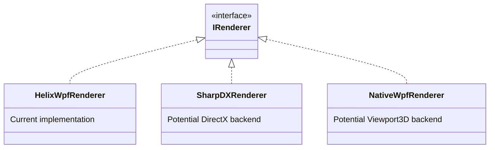
```mermaid
classDiagram
    class IRenderer {
        <<interface>>
    }
    
    class HelixWpfRenderer {
        Current implementation
    }
    
    class SharpDXRenderer {
        Potential DirectX backend
    }
    
    class NativeWpfRenderer {
        Potential Viewport3D backend
    }
    
    IRenderer <|.. HelixWpfRenderer
    IRenderer <|.. SharpDXRenderer
    IRenderer <|.. NativeWpfRenderer
```

The `IRenderer` interface allows adding alternative rendering backends:

```csharp
public enum RendererType
{
    HelixWpf,      // Current implementation
    SharpDX,       // Potential DirectX backend
    NativeWpf      // Potential Viewport3D backend
}
```

### Additional Object Types

New object types can be added by:
1. Adding creation method in `ObjectsViewModel`
2. Adding dimension extraction in `PhysicsHelper.GetObjectDimensions`
3. Adding normalization logic in `PhysicsHelper.NormalizeVisual`

### Persistence

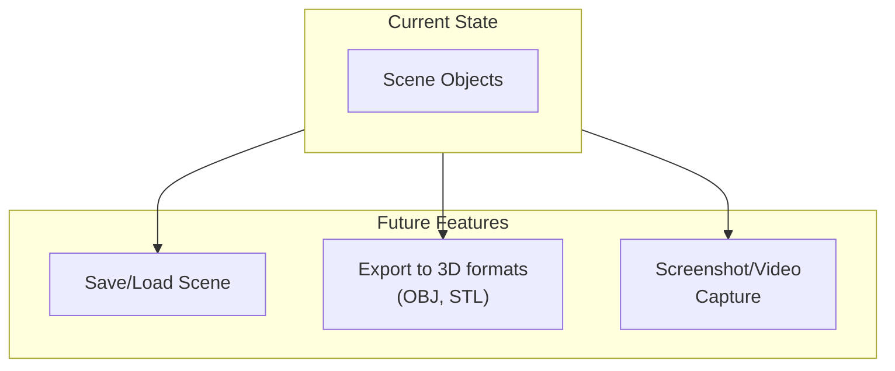
```mermaid
flowchart TB
    subgraph Future["Future Features"]
        Save[Save/Load Scene]
        Export["Export to 3D formats<br/>(OBJ, STL)"]
        Capture["Screenshot/Video<br/>Capture"]
    end
    
    subgraph Current["Current State"]
        Scene[Scene Objects]
    end
    
    Current --> Save
    Current --> Export
    Current --> Capture
```

Future versions could add:
- Save/load scene to file
- Export to 3D formats (OBJ, STL)
- Screenshot/video capture
