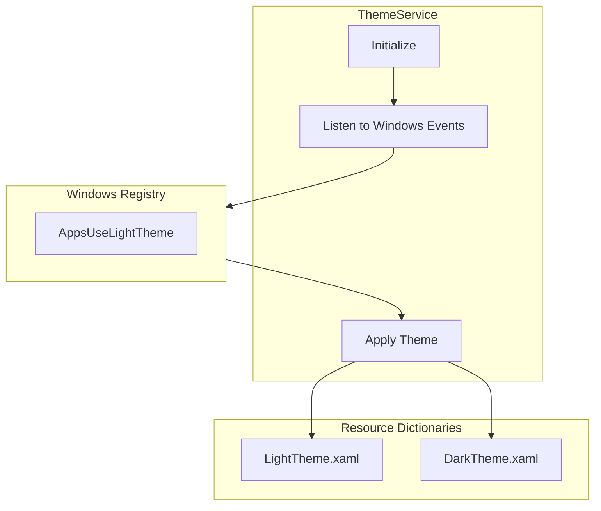
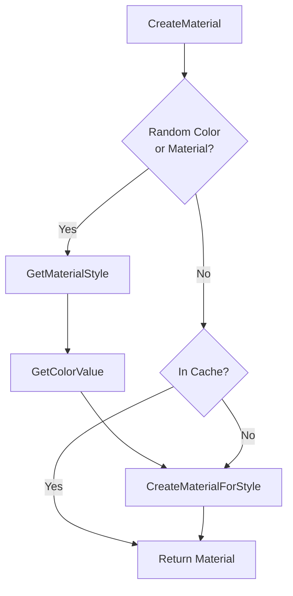
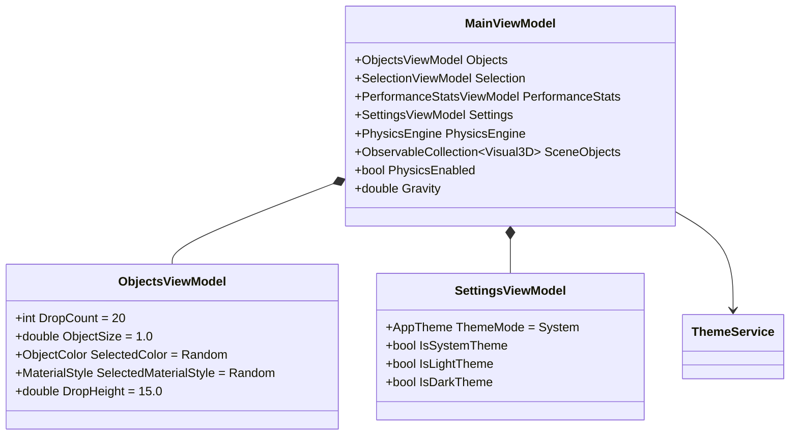

# 3DObjectViewer - Design Document

## Overview

**3DObjectViewer** is a WPF desktop application that provides an interactive 3D environment for creating, manipulating, and observing 3D objects with real-time physics simulation. Users can drop objects into a virtual space and watch them fall, bounce, and interact under the influence of gravity.

### Application Capabilities

| Feature | Description |
|---------|-------------|
| **Object Creation** | Add 3D primitives (cubes, spheres, cylinders, cones, toruses) with customizable size, color, and material |
| **Material Styles** | Choose from 7 material types: Shiny, Metallic, Matte, Glass, Glowing, Neon, and Random |
| **Color Palette** | 10 preset colors (Red, Green, Blue, Yellow, Orange, Purple, Cyan, Pink, White, Gold) plus Random |
| **Batch Drop** | Drop multiple objects simultaneously (1-250 at once, default: 20) |
| **Physics Simulation** | Objects fall under gravity, collide with each other and boundaries, and come to rest naturally |
| **Object Manipulation** | Select objects, drag to move them, adjust position/rotation/scale via sliders |
| **Multi-Viewport** | Three synchronized viewports: Perspective, Top (X-Y), and Side (Y-Z) views |
| **Performance Monitoring** | Real-time display of FPS, frame time, object count, triangle count, and memory usage |
| **Theme Support** | Light, Dark, and Follow Windows system theme modes |

### Default Settings

| Setting | Default Value | Range |
|---------|---------------|-------|
| Drop Count | 20 | 1-250 |
| Drop Height | 15 meters | 2-100 meters |
| Color | Random | 10 colors + Random |
| Material | Random | 6 materials + Random |

### Target Framework
- .NET 10 (Windows)
- WPF (Windows Presentation Foundation)
- C# 14.0

---

## Project Structure

```
3DObjectViewer/
??? Resources/
?   ??? SceneResources.xaml          # Reusable brushes, colors, and styles
?   ??? LightTheme.xaml              # Light theme resource dictionary
?   ??? DarkTheme.xaml               # Dark theme resource dictionary
??? Services/
?   ??? SceneUpdateCoordinator.cs    # Physics-to-UI update throttling
?   ??? ThemeService.cs              # Theme management and Windows integration
??? ViewModels/
?   ??? MainViewModel.cs             # Root ViewModel, orchestrates app
?   ??? ObjectsViewModel.cs          # Object creation settings
?   ??? SelectionViewModel.cs        # Selected object manipulation
?   ??? SettingsViewModel.cs         # Theme and appearance settings
?   ??? PerformanceStatsViewModel.cs # Real-time statistics display
??? Views/Controls/
?   ??? ObjectControlPanel.xaml      # Left sidebar control panel
??? Physics/
?   ??? PhysicsHelper.cs             # Visual3D ? RigidBody bridge
??? MainWindow.xaml                  # Main window with 3 viewports
??? MainWindow.xaml.cs               # View code-behind
??? App.xaml                         # Application entry point

3DObjectViewer.Core/
??? Models/
?   ??? ObjectColor.cs               # Color enumeration
?   ??? MaterialType.cs              # Material style enumeration
?   ??? ThemeMode.cs                 # AppTheme enumeration
??? Physics/
?   ??? ...                          # Physics engine implementations
??? Infrastructure/
    ??? ...                          # MVVM base classes
```

---

## Theme System

### Theme Architecture

The application supports three theme modes:

| Mode | Behavior |
|------|----------|
| **System** | Follows Windows system theme setting (default) |
| **Light** | Always uses light theme |
| **Dark** | Always uses dark theme |



### Theme Resources

Both themes define consistent resource keys:

| Resource Key | Purpose |
|--------------|---------|
| `WindowBackgroundBrush` | Main window background |
| `PanelBackgroundBrush` | Control panel background |
| `PrimaryTextBrush` | Main text color |
| `SecondaryTextBrush` | Dimmed text color |
| `ButtonBackgroundBrush` | Button backgrounds |
| `AccentBrush` | Accent color for highlights |

---

## Material System

### Available Materials

| Material | Description | Default |
|----------|-------------|---------|
| **Random** | Randomly selected material for each object | ? |
| **Shiny** | Standard plastic-like with specular highlights | |
| **Metallic** | Highly reflective metallic surface | |
| **Matte** | Diffuse surface, no specular | |
| **Glass** | Semi-transparent with high specular | |
| **Glowing** | Emissive material that appears to emit light | |
| **Neon** | Bright glowing effect with color bleeding | |

### Material Creation Flow



---

## ViewModels

### ViewModel Hierarchy



### ObjectsViewModel

Manages object creation with configurable settings.

**Default Values (Updated):**

| Property | Default | Range |
|----------|---------|-------|
| `DropCount` | 20 | 1-250 |
| `DropHeight` | 15.0m | 2-100m |
| `SelectedColor` | Random | 11 options |
| `SelectedMaterialStyle` | Random | 7 options |
| `ObjectSize` | 1.0 | 0.5-3.0 |

### SettingsViewModel

Manages application appearance settings.

**Properties:**

| Property | Type | Description |
|----------|------|-------------|
| `ThemeMode` | `AppTheme` | Current theme mode (System/Light/Dark) |
| `IsSystemTheme` | `bool` | Convenience binding for radio button |
| `IsLightTheme` | `bool` | Convenience binding for radio button |
| `IsDarkTheme` | `bool` | Convenience binding for radio button |

---

## User Interface

### Control Panel Sections

```
???????????????????????????
? 3D Object Controls      ?
???????????????????????????
? Add Objects             ?
? ?? Drop Count: [==20==] ?
? ?? [Add Cube(s)]        ?
? ?? [Add Sphere(s)]      ?
? ?? ...                  ?
? ?? [Add Random Mix]     ?
???????????????????????????
? New Object Settings     ?
? ?? Color: [swatches]    ?
? ?   ? Random Color ?    ?
? ?? Material:            ?
? ?   ? Random Material ? ?
? ?   ? Shiny (Plastic)   ?
? ?   ? Metallic          ?
? ?   ...                 ?
? ?? Size: [=1.0=]        ?
? ?? Drop Height: [=15=]m ?
???????????????????????????
? Physics                 ?
? ?? [?] Enable Physics   ?
? ?? Gravity: [=9.8=]     ?
???????????????????????????
? Appearance              ?
? ?? Theme:               ?
? ?   ? Follow Windows ?  ?
? ?   ? Light             ?
? ?   ? Dark              ?
???????????????????????????
? Selected Object (if any)?
? ...                     ?
???????????????????????????
? Scene                   ?
? ?? [Clear All] [Reset]  ?
???????????????????????????
```

---

## Dependencies

| Package | Version | Purpose |
|---------|---------|---------|
| HelixToolkit.Wpf | 2.x | 3D rendering and viewport |
| BepuPhysics | 2.x | Physics simulation |
| 3DObjectViewer.Core | local | Physics engine and infrastructure |

---

## Design Decisions

### 1. Random as Default

**Decision:** Random color and Random material are the default settings.

**Rationale:** Creates visually interesting scenes immediately without user configuration. Each object gets variety automatically.

### 2. Generous Drop Limits

**Decision:** Max drop count increased to 250, default to 20.

**Rationale:** 
- Users requested ability to create large scenes quickly
- Physics engine handles 250+ objects efficiently with threading
- Default of 20 balances performance and visual impact

### 3. AppTheme Naming

**Decision:** Use `AppTheme` enum instead of `ThemeMode`.

**Rationale:** .NET 10 introduced `System.Windows.ThemeMode`, causing naming conflict. `AppTheme` is unambiguous.

### 4. Follow Windows as Default

**Decision:** Theme defaults to following Windows system setting.

**Rationale:** 
- Respects user's system-wide preference
- No jarring contrast with other Windows apps
- Users can override if desired
