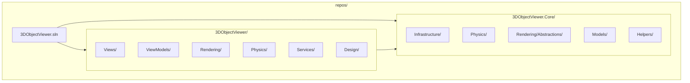
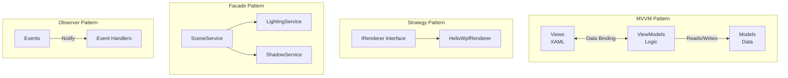
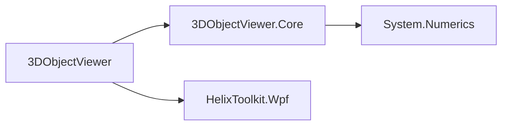
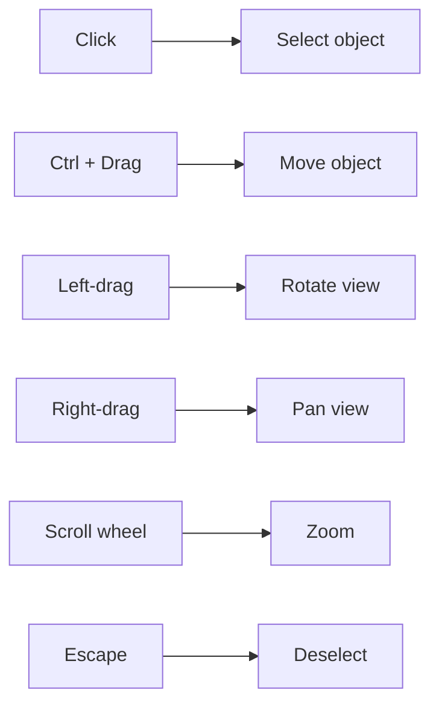

# 3D Object Viewer

A WPF desktop application for creating, manipulating, and viewing 3D objects with physics simulation.

## Solution Structure

The solution is organized into two sibling projects:



### 3DObjectViewer.Core (Platform Library)

A reusable class library containing platform-independent core functionality:

| Folder | Description |
|--------|-------------|
| **Infrastructure/** | MVVM base classes (`ViewModelBase`, `RelayCommand`) and value converters |
| **Physics/** | Physics engine with SIMD-optimized collision detection (`PhysicsEngine`, `RigidBody`, `SimdMath`) |
| **Rendering/Abstractions/** | Renderer interfaces and contracts (`IRenderer`, `ISceneObject`, `IRendererFactory`) |
| **Models/** | Shared data models (`LightSource`, `ObjectColor`) |
| **Helpers/** | Utility classes (`DragPlane3D`) |

### 3DObjectViewer (Application)

The WPF application containing UI and renderer implementations:

| Folder | Description |
|--------|-------------|
| **Views/** | XAML controls and user interfaces |
| **ViewModels/** | Application-specific view models (`MainViewModel`, `ObjectsViewModel`, etc.) |
| **Rendering/HelixWpf/** | HelixToolkit.Wpf renderer implementation |
| **Rendering/Services/** | Lighting and shadow services |
| **Services/** | Scene orchestration (`SceneService`) |
| **Physics/** | Visual-specific physics helpers (`PhysicsHelper`) |

## Features

- **Object Creation**: Add 3D primitives (cubes, spheres, cylinders, cones, toruses)
- **Physics Simulation**: SIMD-accelerated gravity, collisions, and object dynamics
- **Object Manipulation**: Select, drag, rotate, and scale objects
- **Dynamic Lighting**: Multiple configurable light sources with presets
- **Real-time Shadows**: Objects cast shadows onto the ground plane
- **Performance Monitoring**: Live FPS, memory, and triangle count display

## Architecture

### Design Patterns



- **MVVM**: Clean separation of UI (Views), logic (ViewModels), and data (Models)
- **Strategy Pattern**: Swappable renderer implementations via `IRenderer`
- **Facade Pattern**: `SceneService` coordinates lighting and shadow services
- **Observer Pattern**: Event-driven communication between components

### Key Dependencies



- **HelixToolkit.Wpf**: 3D rendering and viewport controls
- **System.Numerics**: SIMD-accelerated vector math

## Requirements

- .NET 10.0 (Windows)
- Windows OS with WPF support

## Building

```bash
dotnet restore
dotnet build 3DObjectViewer.sln
```

## Running

```bash
dotnet run --project 3DObjectViewer/3DObjectViewer.csproj
```

## Mouse Controls



| Action | Control |
|--------|---------|
| Select object | Click |
| Move object | Ctrl + Drag |
| Rotate view | Left-drag |
| Pan view | Right-drag |
| Zoom | Scroll wheel |
| Deselect | Escape |

## License

See LICENSE file for details.
